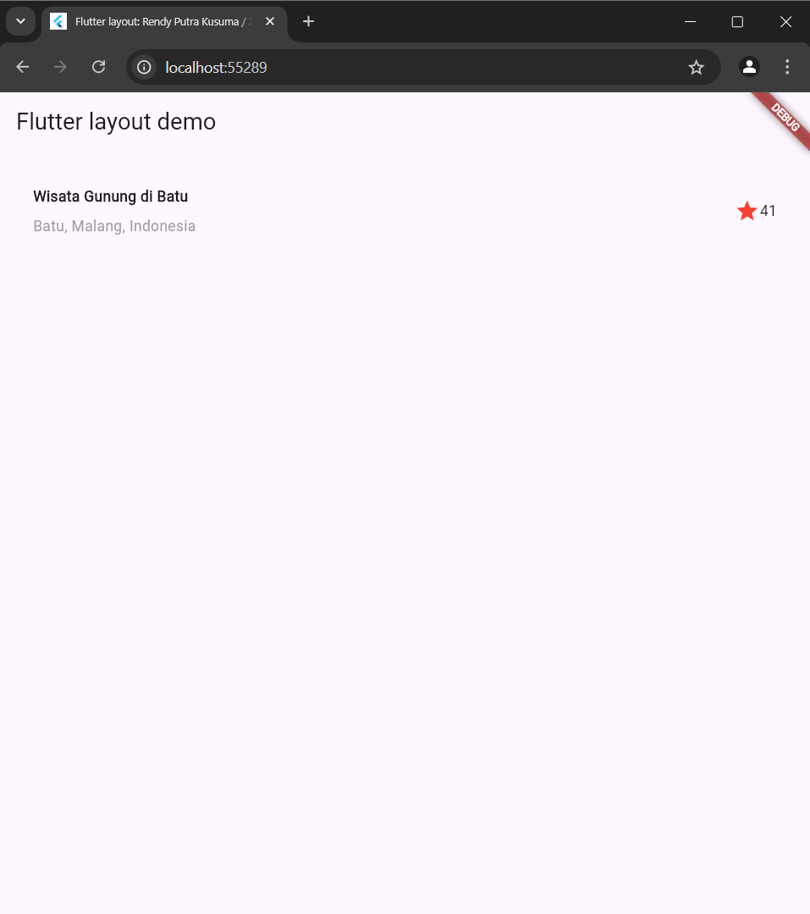
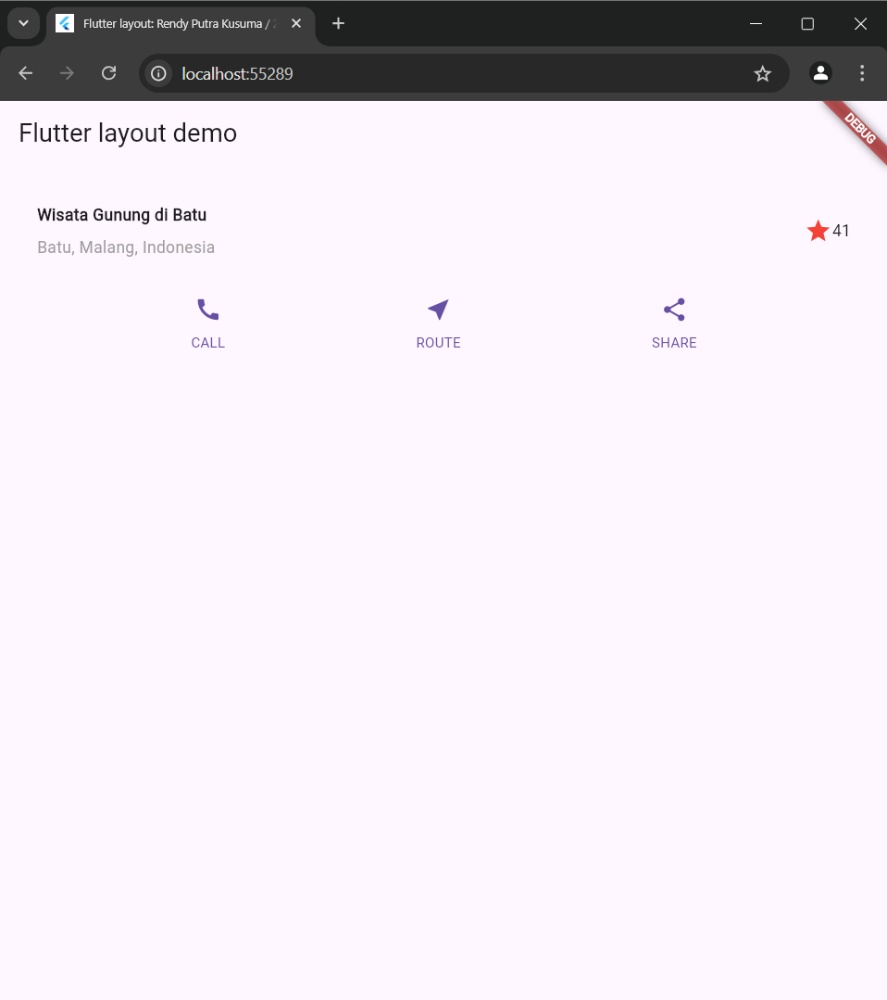
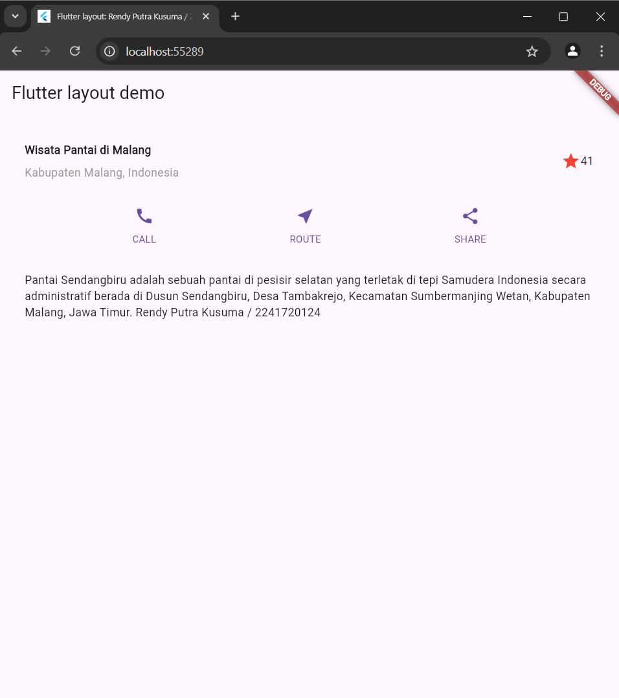
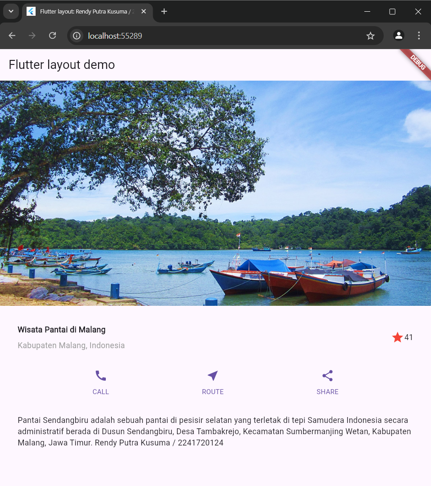
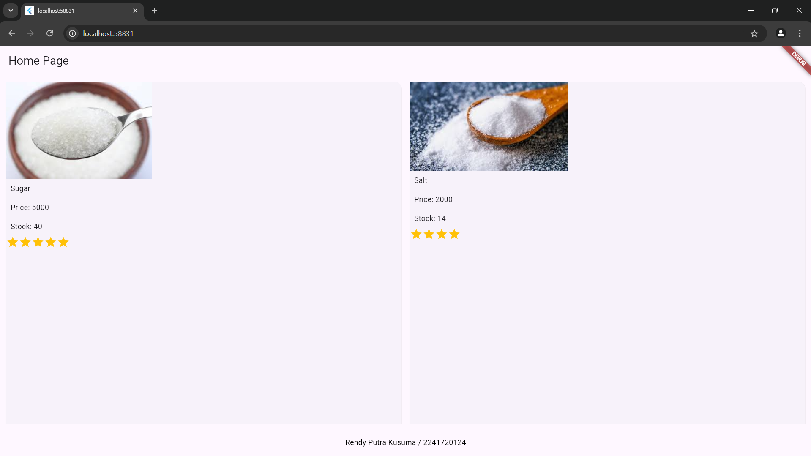

# Jobsheet 6

# Tugas 1

## Praktikum 1

Membangun layout di Flutter

## Praktikum 2

Menambahkan tombol ke layout

## Praktikum 3

Menambahkan text ke layout

## Praktikum 4

Menambahkan gambar ke layout

# Tugas 2

