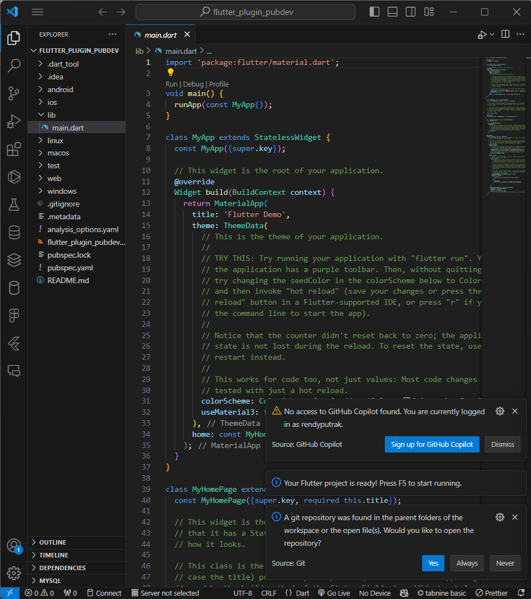
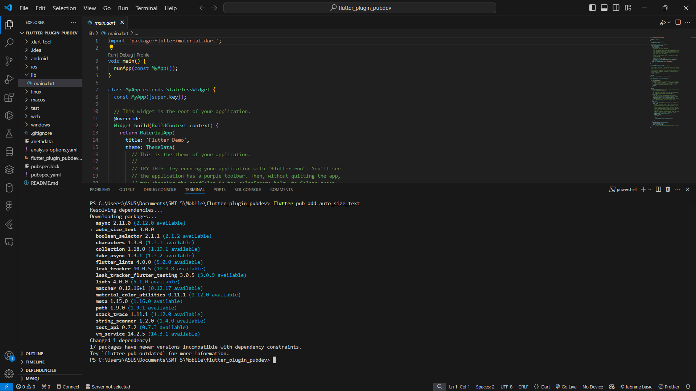
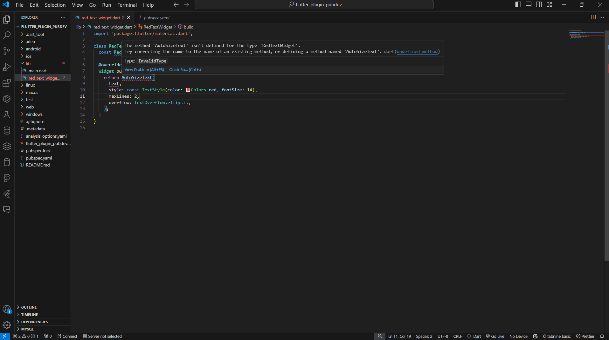
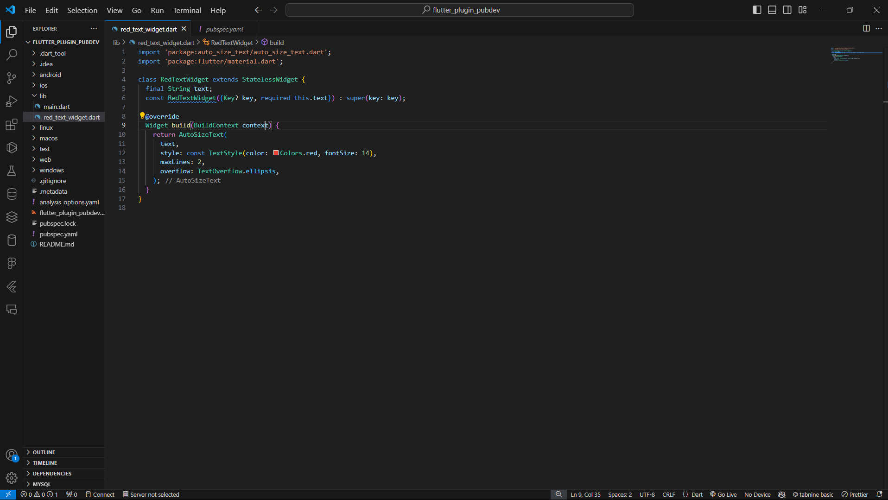
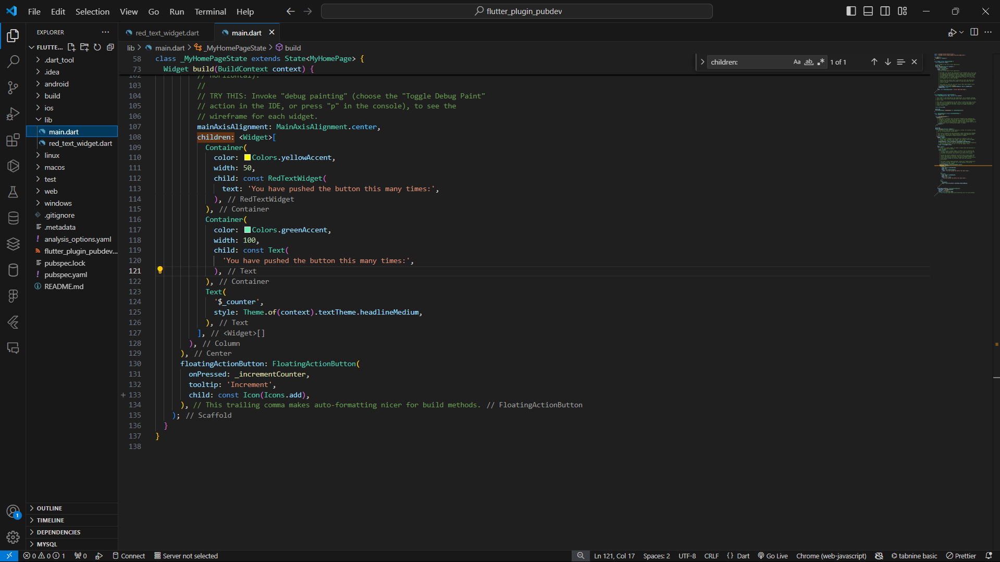
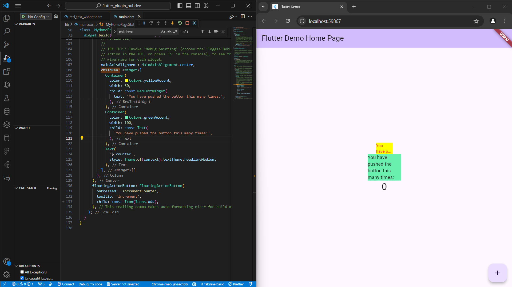

# Jobsheet 6

## Langkah 1

Membuat project flutter baru dengan nama flutter_plugin_pubdev

## Langkah 2

Menambahkan plugin auto_size_text menggunakan terminal

## Langkah 3

Membuat file baru bernama red_text_widget.dart di dalam folder lib

## Langkah 4

Mengubah kode di red_text_widget.dart, error terjadi dikarenakan plugin belum diimport

## Langkah 5

Menambahkan variabel text dan parameter di constructor untuk mendefinisikan RedTextWidget

## Langkah 6

Menambahkan widget di main.dart

## Jelaskan maksud dari langkah 2 pada praktikum tersebut!

Langkah 2 berfungsi untuk menambahkan plugin auto_size_text ke dalam proyek Flutter dengan menjalankan perintah flutter pub add auto_size_text di terminal. Perintah ini akan menambahkan plugin auto_size_text ke dalam file pubspec.yaml.

## Jelaskan maksud dari langkah 5 pada praktikum tersebut!

menambahkan variabel text bertipe String dan membuatnya sebagai parameter dalam constructor RedTextWidget.

## Pada langkah 6 terdapat dua widget yang ditambahkan, jelaskan fungsi dan perbedaannya!

RedTextWidget widget yang menampilkan teks berwarna merah dan dapat menyesuaikan ukuran font secara otomatis, sedangkan Text adalah widget dasar untuk menampilkan teks statis. RedTextWidget bisa menyesuaikan ukuran font agar sesuai dengan ruang yang tersedia, sedangkan Text tidak bisa.

## Jelaskan maksud dari tiap parameter yang ada di dalam plugin auto_size_text berdasarkan tautan pada dokumentasi ini !

1. maxLines: Menentukan jumlah maksimum baris teks yang dapat ditampilkan.
2. minFontSize: Ukuran font terkecil yang akan digunakan.
3. maxFontSize: Ukuran font terbesar yang akan digunakan.
4. stepGranularity: Ukuran langkah untuk mengubah ukuran font saat menyesuaikan.
5. presetFontSizes: Daftar ukuran font yang akan dicoba untuk penyesuaian.
6. group: Memungkinkan penyinkronan ukuran font di beberapa instance AutoSizeText.
7. overflowReplacement: Widget yang ditampilkan jika teks melampaui batas yang ditentukan.
